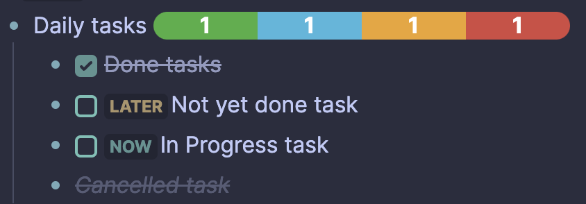

# Logseq Better Tasks Plugin

Collection of utilities to make tasks more useful in Logseq

## Features

### Repeating task heatmap

Allows you to visualize your repeating task completion over last several days, or the whole year

#### Usage

Just put the text `{{renderer better-tasks}}` or `{{renderer better-tasks expanded}}` (for the whole year view) in the
end of a block containing the repeating task you want to visualize.
The end result should look like this:

```markdown
- LATER Use Logseq to organize my thoughts
  SCHEDULED: <2023-07-04 Tue .+1d>
  :LOGBOOK:
  // log entries here
  :END:
  {{renderer better-tasks expanded}}
```

- Minimal heatmap view
  
- Full heatmap view
  

- Clicking on a day will toggle the completion of the task on that day.

##### Theming

Use the classes `bt-grid-item` `completed` and `today-item` to customise colors of the heatmap (or fix them if your
theme is not supported).

```css
.bt-grid-item {
    border-color: white;
}

.bt-grid-item.completed {
    background-color: green;
}

.bt-grid-item.today-item {
    border-color: red;
}
```

### Task completion progress bar

Visual indicator of progress for nested tasks.

#### Usage

Just put the text `{{renderer better-tasks-progress}}` in the block that is a parent to all the tasks you want to
visualize.

```markdown
- Daily tasks {{renderer better-tasks-summary}}
    - DONE Done tasks
    - LATER Not yet done task
    - NOW In Progress task
    - CANCELED Cancelled task
```

