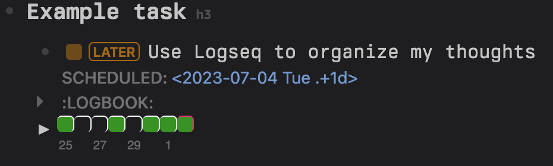
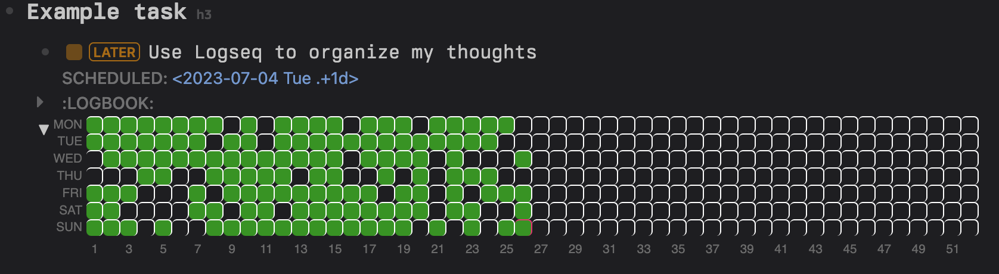

# Logseq Better Tasks Plugin

Collection of utilities to make tasks more useful in Logseq

## Features

### Repeating task heatmap

Allows you to visualize your repeating task completion over last several days, or the whole year

#### Usage

Just put the text `{{renderer better-tasks}}` or `{{renderer better-tasks expaned}}` (for the whole year view) in the end of a block containing the repeating task you want to visualize.
The end result should look like this:

```markdown
- LATER Use Logseq to organize my thoughts
  SCHEDULED: <2023-07-04 Tue .+1d>
  :LOGBOOK:
  // log entries here
  :END:
  {{renderer better-tasks expanded}}
```

- Minimal heatmap view
  
- Full heatmap view
  

## Planned

- [ ] More heatmap views for other repetition types (weekly, monthly)
- [ ] "Lax" task repetition.
  - For example when you have a weekly task that you missed, the next date upon completion would be changed to an occurence in the future, instead of the missed one in the past like in the default behavior.
